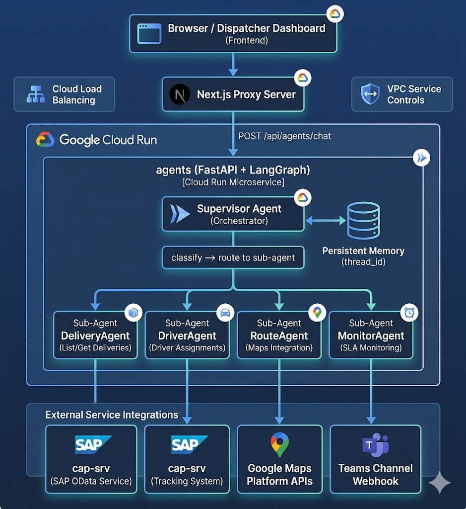

# NeXera — AI-Powered Logistics Dispatch Platform

**Hackathon:** Google for Startups AI Agents Challenge
**Author:** Sriram Rokkam · NeXera-AI-Labs
**Live demo:** [https://frontend-5pcgzahy4q-uc.a.run.app/login](https://frontend-5pcgzahy4q-uc.a.run.app/login)

---

## Demo Credentials

The **Acme Logistics** tenant is pre-loaded with 100 SAP deliveries, an active ERP connection, and warehouse WH-1710 (Bangalore).

| Role | Email | Password | Access |
|---|---|---|---|
| Admin | `admin@acme.demo` | `Demo@2026` | Full admin + dispatch |
| Dispatcher | `dispatcher@acme.demo` | `Demo@2026` | Dispatch dashboard + AI chat |
| Supervisor | `supervisor@acme.demo` | `Demo@2026` | Warehouse supervisor view |
| Driver | — | — | No login — scan QR from any assigned delivery |

> **Quick start for judges:** Log in as `dispatcher@acme.demo` / `Demo@2026` to go directly to the dispatch dashboard with 100 live SAP deliveries already imported.

NeXera is a multi-tenant SaaS platform for logistics dispatch — connecting ERP systems (SAP S/4HANA today; Odoo / Oracle / SAP ECC planned) to an AI-powered dispatcher dashboard with real-time driver tracking. Both 1PL (own fleet) and 3PL (managed logistics) operators run on the same platform.

---

## Table of Contents

1. [Demo Credentials](#demo-credentials)
2. [Architecture](#architecture)
3. [Live Services](#live-services)
4. [How to Test the Demo](#how-to-test-the-demo)
   - [Step 1 — Sign up (first tenant)](#step-1--sign-up-first-tenant)
   - [Step 2 — Onboard a Warehouse](#step-2--onboard-a-warehouse)
   - [Step 3 — Connect SAP ERP](#step-3--connect-sap-erp)
   - [Step 4 — Dispatch a Delivery](#step-4--dispatch-a-delivery)
   - [Step 5 — Driver tracking (mobile)](#step-5--driver-tracking-mobile)
   - [Step 6 — Confirm delivery + Teams alert](#step-6--confirm-delivery--teams-alert)
   - [Step 7 — AI Chat Assistant](#step-7--ai-chat-assistant)
4. [Local Development](#local-development)
5. [Deployment](#deployment)
6. [Project Structure](#project-structure)
7. [GCP Resources](#gcp-resources)
8. [Design Spec](#design-spec)

---

## Architecture



---

## Live Services

| Service | URL | Purpose |
|---|---|---|
| **frontend** | `https://frontend-5pcgzahy4q-uc.a.run.app` | Next.js dashboard, tracking page |
| **cap-srv** | `https://cap-srv-1069189829983.us-central1.run.app` | OData V4 + SAP integration |
| **agents** | `https://agents-5pcgzahy4q-uc.a.run.app` | LangGraph AI agents |

All in GCP project `agentic-dispatch`, region `us-central1`.

---

## How to Test the Demo

> Screenshots referenced below live in [`docs/screenshots/`](docs/screenshots/). If a screenshot is missing in your fork, the live URL still works the same way — open the link and follow along.

### Step 1 — Sign up (first tenant)

Open the live URL and click **Sign Up** (top right).


Fill in:
- **Company name:** e.g. `Acme Logistics`
- **Your name:** your full name
- **Email:** your email (used to log in)
- **Password:** min 8 characters


You'll be redirected to the dashboard as the first **Admin** of your tenant.

### Step 2 — Onboard a Warehouse

From the admin dashboard, click **Onboarding Wizard** (or **Add Warehouse**).


The wizard walks through:
1. **Warehouse number** (e.g. `1710` — must match your ERP warehouse)
2. **Physical address** — used as origin for route maps
3. **Working hours** — used by the MonitorAgent for SLA alerts
4. **Manager assignment** — invite a WH Manager by email (optional for demo)


After creation, the warehouse appears in the warehouse list. The address is geocoded and stored as `latitude`/`longitude` for route rendering.

### Step 3 — Connect SAP ERP

Still in the admin dashboard, go to **Connections → Add ERP**.


For the demo, use the SAP Sandbox:
- **Type:** SAP S/4HANA
- **Auth:** API Key (Sandbox)
- **Base URL:** `https://sandbox.api.sap.com/s4hanacloud`
- **API key:** stored in Secret Manager — your tenant's `secret_ref`

The system validates the connection by fetching the warehouse list from SAP. Once green, you can see live deliveries.

### Step 4 — Dispatch a Delivery

Switch to the **Dispatch** tab. You'll see live outbound deliveries pulled from SAP (`OutboundDeliveries`).


Click any delivery to open the dispatch detail view:


Click **Assign Driver**:
- **Driver name:** e.g. `Ravi Kumar`
- **Mobile:** the driver's phone (used for QR-link SMS in production)
- **Truck registration:** e.g. `KA-01-AB-1234`

After assignment, a **QR code** appears. The QR link points to `/tracking/{assignmentId}` on this same frontend.


### Step 5 — Driver tracking (mobile)

Scan the QR with your phone (or open the link in a new tab to simulate).


The page:
- Asks for **location permission** on first load
- Sends GPS via `navigator.geolocation.watchPosition` + a 60-second poll
- Shows delivery details, driver name, truck, ETA
- Has a **Confirm Delivery** button at the bottom

If GPS isn't available (desktop, browser denied permission), use **Simulate GPS** to send mock coordinates — useful for screen recording the demo.

Meanwhile, on the dispatcher dashboard, the driver pin appears on the map and updates every 30 seconds:


### Step 6 — Confirm delivery + Teams alert

When the driver taps **Confirm Delivery**, the assignment status flips to `DELIVERED` and:
- The dispatcher dashboard shows the green status badge
- A Teams webhook fires (if `TEAMS_WEBHOOK_URL` is configured) to your channel:


### Step 7 — AI Chat Assistant

The chat panel (bottom-right of the dispatch screen) routes to the LangGraph agents.


Try:
- *"Show me overdue deliveries"* → DeliveryAgent lists them
- *"Status of delivery 80000003"* → DriverAgent fetches the assignment + GPS
- *"What's the route from warehouse 1710 to delivery 80000003?"* → RouteAgent calls Google Maps

The supervisor classifies each message and routes to the right ReAct subagent. Tools wrap CAP OData calls and Google Maps Directions API.

---

## Local Development

### Prerequisites
- Node.js 20+
- Python 3.11+
- `gcloud` CLI logged in to `agentic-dispatch`
- `gcloud auth application-default login` (for Vertex AI)

### Frontend (port 3000)

```bash
cd frontend/nexera-dispatch
npm install
cp .env.local.example .env.local   # if exists
npm run dev
```

`.env.local` needs:
```
DATABASE_URL=postgresql://...        # local pg or Cloud SQL Proxy
JWT_SECRET=dev-secret
NEXT_PUBLIC_CAP_URL=https://cap-srv-1069189829983.us-central1.run.app
NEXT_PUBLIC_GOOGLE_MAPS_KEY=<key>
AGENTS_URL=http://localhost:8000     # if running agents locally
```

### Agents (port 8000)

```bash
cd agents
python3 -m venv .venv && source .venv/bin/activate
pip install -r requirements.txt
cp .env.example .env                 # fill in CAP_BASE_URL, TEAMS_WEBHOOK_URL
PYTHONPATH=. uvicorn main:app --reload
```

### cap-srv

cap-srv is deployed on Cloud Run — no need to run it locally. If you must:

```bash
cd cap-srv
npm install
npm start    # uses CAP's local SQLite — won't have your Cloud SQL data
```

---

## Deployment

CI/CD runs automatically on every push to `main`. The workflow:

1. **Cloud Build trigger** `CICD-GCP-Hackethon` watches `main` branch
2. **`cloudbuild.yaml`** at the repo root:
   - Builds `frontend` and `agents` Docker images in parallel
   - Pushes to Artifact Registry
   - Deploys both to Cloud Run with secrets attached
   - Updates `cap-srv` with the new `FRONTEND_BASE_URL`
3. **DB migrations** run separately as a Cloud Run job:
   ```bash
   gcloud run jobs execute frontend-migrate --region us-central1 --project agentic-dispatch --wait
   ```

See [`CLAUDE.md`](CLAUDE.md) for the full deployment architecture and gotchas.

---

## Project Structure

```
.
├── agents/                  FastAPI + LangGraph (Python 3.11)
│   ├── agents/              Supervisor + Delivery/Driver/Route/Monitor
│   ├── tools/               OData client + delivery/driver/route/teams tools
│   ├── tests/               pytest unit tests
│   ├── main.py              FastAPI app
│   └── Dockerfile           Cloud Run image
├── cap-srv/                 SAP CAP Node.js OData V4
│   ├── db/                  CDS schemas
│   ├── srv/                 Service definitions + JS handlers
│   ├── app/                 Legacy Fiori UI (kept as fallback)
│   └── Dockerfile           Cloud Run image
├── frontend/nexera-dispatch/  Next.js 14 + Tailwind + shadcn/ui
│   ├── app/
│   │   ├── api/             Server-side route handlers
│   │   ├── dashboard/       Admin / Dispatch / Warehouse views
│   │   ├── tracking/[id]/   Public driver tracking page
│   │   ├── login signup invite
│   │   └── layout.tsx
│   ├── components/          chat-panel, delivery-map, qr-display, etc.
│   ├── lib/                 api, auth, db (pg client), types, utils
│   ├── scripts/migrate.sql  Postgres schema
│   ├── Dockerfile           Multi-stage Next.js standalone build
│   └── Dockerfile.migrate   Cloud Run job image for migrations
├── docs/
│   ├── screenshots/         Demo screenshots referenced in this README
│   └── superpowers/
│       ├── specs/           Design specs
│       └── plans/           Implementation plans
├── cloudbuild.yaml          Root CI/CD pipeline
├── CLAUDE.md                Architecture + gotchas (for Claude Code)
└── README.md                (this file)
```

---

## GCP Resources

| Resource | Detail |
|---|---|
| **Project** | `agentic-dispatch` |
| **Region** | `us-central1` |
| **Cloud Run** | `frontend`, `cap-srv`, `agents` |
| **Cloud Run Jobs** | `frontend-migrate` (one-shot DB migration) |
| **Cloud SQL** | `nexera-sbx-db` (Postgres 18, db-f1-micro shared core) |
| **Database** | `dispatch` (single DB shared by frontend + cap-srv) |
| **Vertex AI** | Gemini 2.5 Flash |
| **Secret Manager** | `DATABASE_URL`, `JWT_SECRET`, `DB_PASSWORD`, `GOOGLE_MAPS_API_KEY`, `SAP_SANDBOX_API_KEY`, `TEAMS_WEBHOOK_URL` |
| **Artifact Registry** | `us-central1-docker.pkg.dev/agentic-dispatch/cloud-run-source-deploy` |
| **Cloud Build trigger** | `CICD-GCP-Hackethon` (auto on push to `main`) |
| **GitHub repo** | `NeXera-AI-Labs/Dispatch-Agents-GCP` |

---

## Design Spec

Full platform design: [`docs/superpowers/specs/2026-05-16-nexera-platform-design.md`](docs/superpowers/specs/2026-05-16-nexera-platform-design.md)

Map feature design: [`docs/superpowers/specs/2026-05-22-delivery-map-design.md`](docs/superpowers/specs/2026-05-22-delivery-map-design.md)

Implementation plans:
- [Plan 1 — DB + Auth](docs/superpowers/plans/2026-05-16-plan1-db-auth.md)
- [Plan 2 — Frontend](docs/superpowers/plans/2026-05-16-plan2-frontend.md)
- [Plan 3 — AI Chat](docs/superpowers/plans/2026-05-16-plan3-ai-chat.md)
- [Delivery Map](docs/superpowers/plans/2026-05-22-delivery-map.md)
